### Simple Left-Right Graph
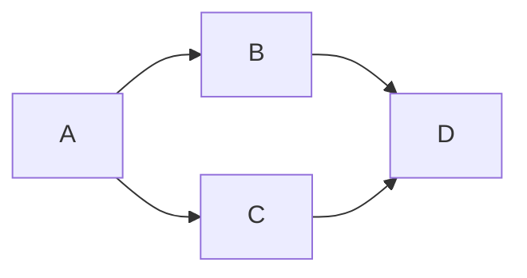

### Simple Graph to Mark Chapters
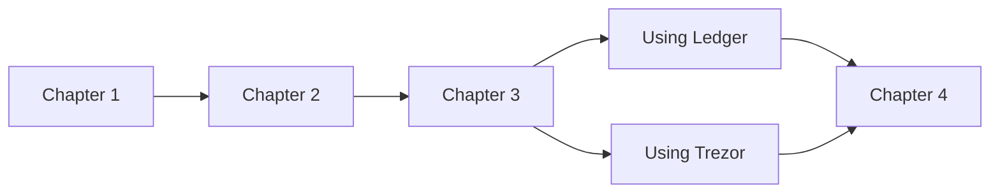

### Simple Top-Down Graph


### Dependency Sets
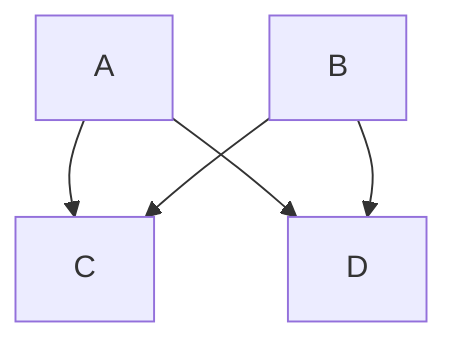

### Binary Tree
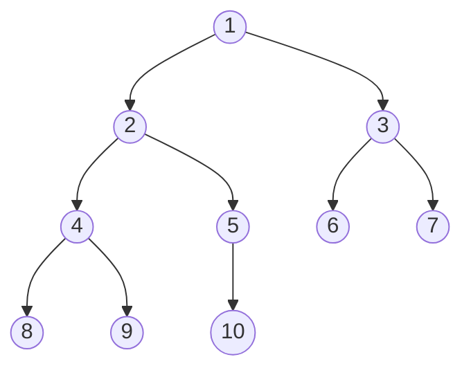

### Graph Shape & Link Variants
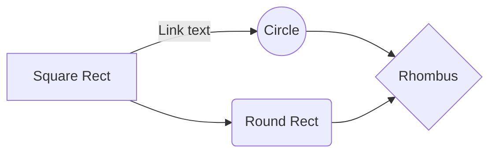

### Basic Flowchart
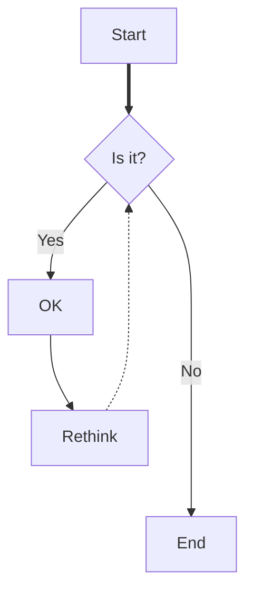

### Complex Flowchart "Coffee Machine Not Working?"
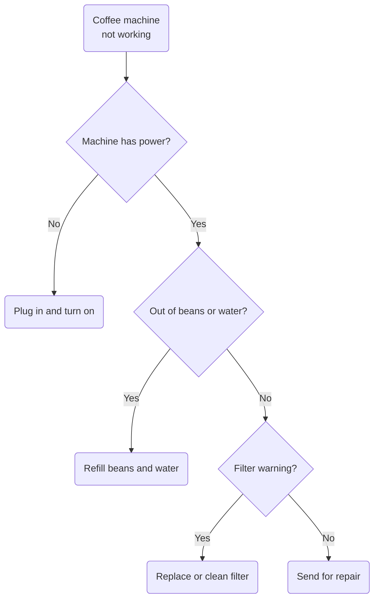

### Flowchart with Hyperlinks
```mermaid
flowchart LR;
    A-->B["\"B#dagger; (internal link)\""];
    B-->C;
    C-->D["\"D#ddagger; (external link)\""];
    click B \"https:\/\/gist.github.com\/ChristopherA\/bffddfdf7b1502215e44cec9fb766dfd\/#flowchart-with-hyperlinks\"
    click D \"https:\/\/gist.github.com\/ChristopherA\/\"
```

### More Complex Example
```mermaid
  flowchart LR;
      A["CI MULTI CHAPTCHA"]-->B{Select captcha service by developer?"};
      classDef green color:#022e1f,fill:#00f500;
      classDef red color:#022e1f,fill:#f11111;
      classDef white color:#022e1f,fill:#fff;
      classDef black color:#fff,fill:#000;
      B--YES-->C["How to use?"]:::green;
      
      C-->U["I choose recaptcha."]:::green;
      U--Views-->Q["\"echo CIMC_JS('recaptcha');\\n echo CIMC_HTML(['captcha_name'=>'recaptcha']);\""]:::green;
      U--Controller-->W["\"CIMC_RULE('recaptcha');\""]:::green;
      
      C-->I["I choose arcaptcha."]:::white;
      I--Views-->O["\"echo CIMC_JS('arcaptcha');\\n echo CIMC_HTML(['captcha_name'=>'arcaptcha']);\""]:::white;
      I--Controller-->P["\"CIMC_RULE('arcaptcha');\""]:::white;
      
      C-->X["I choose bibot."]:::red;
      X--Views-->V["\"echo CIMC_JS('bibot');\\n echo CIMC_HTML(['captcha_name'=>'bibot']);\""]:::red;
      X--Controller-->N["\"CIMC_RULE('bibot');\""]:::red;
      
      B--NO-->D["How to use?"]:::black;
      D---Views:::black-->F["\"echo CIMC_JS('randomcaptcha');\\n echo CIMC_HTML(['captcha_name'=>'randomcaptcha']);\""]:::black; 
      D---Controller:::black-->T["\"CIMC_RULE('archaptcha,recaptcha,bibot');\""]:::black;
```

### Subgraph
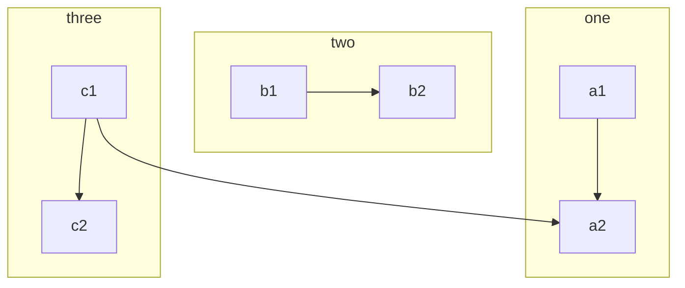

### Themed Subgraph
```mermaid
graph LR
    subgraph 1["System Flow"]
        CP(["Command Palette"])
        subgraph 2["Black Box"]
            QA(Quick Addition)
            QM(Macro)
        end
        B["Call Script"]
        C["Open URI"]
        D["Load Workspace"]
        CP --> QA --> QM --> B --> C --> D
    end
style 1 fill:#333333,stroke:#FFFFFF,stroke-width:2px
style 2 fill:#222222,stroke:#FFFFFF,stroke-width:1px
```

### Flowchart with Styling
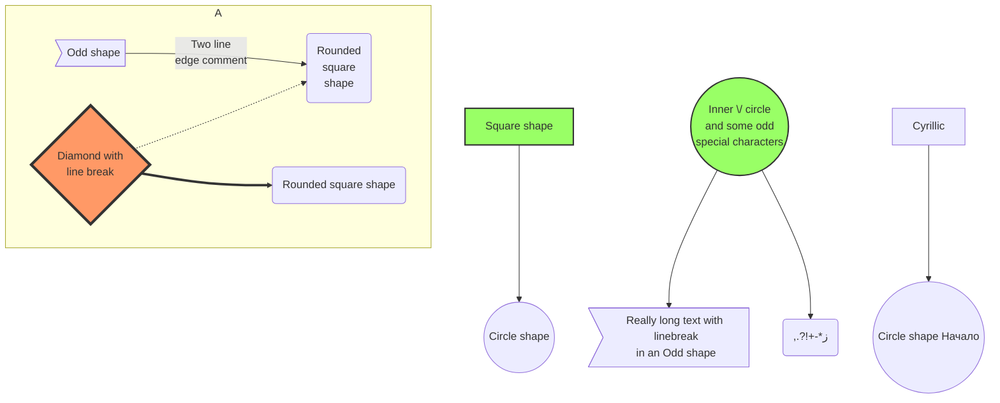

### Decision Tree
```mermaid
graph TB
A(\"Do you think online service\nlearning is right for you?\")
B(\"Do you have time to design\na service learning component?\")
C(\"What is the civic or public purpose of your discipline?\nHow do you teach that without service learning?\")
D(\"Do you have departmental or school\nsupport to plan and implement service learning?\")
E["\"Are you willing to be a trailblazer?\""] 
F["\"What type of service learning to you want to plan?\""]

A==Yes==>B
A--No-->C
B==Yes==>D
B--No-->E
D--Yes-->F
D--No-->E
E--Yes-->F
E--No-->C
```

### Styled Links
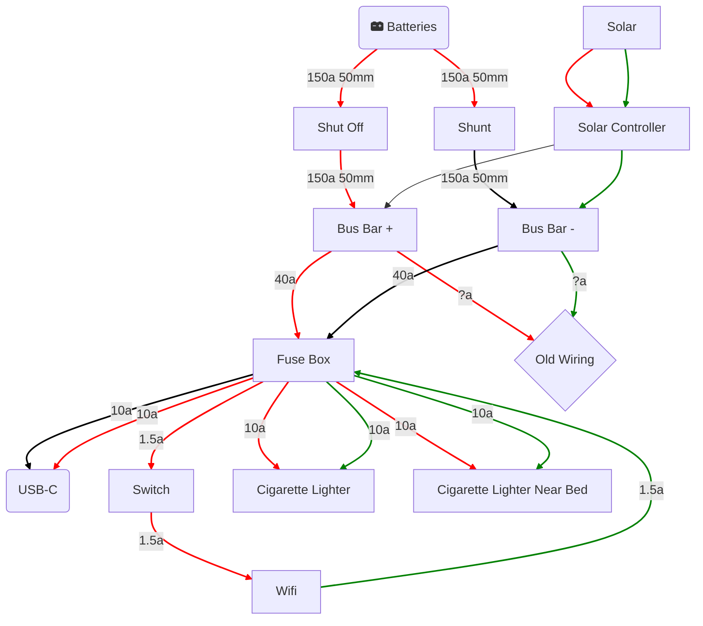

### Styled Flowchart with Titles
```mermaid
graph TD%% Adding a title to the flowchart using the SubGraph feature
subgraph SGTitle ["\"WHAT IS THE ROOT CAUSE OF THE PROBLEM? ____\""]

%% Nodes
    0["Key Variable<br>Target: 100, Actual: 80"]
    1["Top Variable 1<br>Tgt: 20, Act: 20"]
    2["Top Variable 2<br>Tgt: 30, Act: 30"]
    3["Top Variable 3<br>Tgt: 50, Act: 30"]
    31["Sub Variable 1<br>Tgt: 25, Act: 25"]
    32["Sub Variable 2<br>Tgt: 25, Act: 5"]
    321["Element 1<br>Tgt: 20, Act: 1"]
    322["Element 2<br>Tgt: 5, Act: 4"]
    
%% Close title subgraph
end
    
%% Links
    0 --- 1
    0 --- 2
    0 --- 3
    3 --- 31
    3 --- 32
    32 --- 321
    32 --- 322
    
%% Defining node styles
    classDef Red fill:#FF9999;
    classDef Amber\tfill:#FFDEAD;
    classDef Green fill:#BDFFA4;

%% Assigning styles to nodes
    class 3,32,321 Red;
    class 322 Amber;
    class 1,2,31 Green;
    
%% Changing color of links [NOTE: Link arrows will remain black]
    linkStyle default fill: none, stroke: grey;
    
%% Styling the title subgraph

    classDef Title fill:#FF99FF00, stroke-width:0, color:grey, font-weight:bold, font-size: 17px;
    class SGTitle Title;
```

### Quadrant Chart
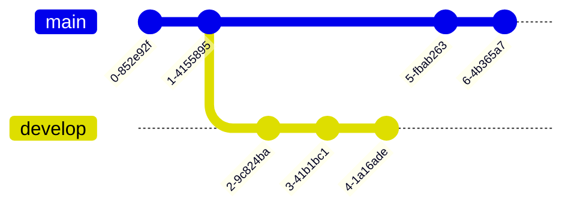

### XY Chart
```mermaid
xychart-beta
    title \"Sales Revenue\"
    x-axis [jan, feb, mar, apr, may, jun, jul, aug, sep, oct, nov, dec]
    y-axis \"Revenue (in $)\" 4000 --> 11000
    bar [5000, 6000, 7500, 8200, 9500, 10500, 11000, 10200, 9200, 8500, 7000, 6000]
    line [5000, 6000, 7500, 8200, 9500, 10500, 11000, 10200, 9200, 8500, 7000, 6000]
```

### C4 Context
```mermaid
    C4Context
      title System Context diagram for Internet Banking System
      Enterprise_Boundary(b0, \"BankBoundary0\") {
        Person(customerA, \"Banking Customer A\", \"A customer of the bank, with personal bank accounts.\")
        Person(customerB, \"Banking Customer B\")
        Person_Ext(customerC, \"Banking Customer C\", \"desc\")

        Person(customerD, \"Banking Customer D\", \"A customer of the bank, <br/> with personal bank accounts.\")

        System(SystemAA, \"Internet Banking System\", \"Allows customers to view information about their bank accounts, and make payments.\")

        Enterprise_Boundary(b1, \"BankBoundary\") {

          SystemDb_Ext(SystemE, \"Mainframe Banking System\", \"Stores all of the core banking information about customers, accounts, transactions, etc.\")

          System_Boundary(b2, \"BankBoundary2\") {
            System(SystemA, \"Banking System A\")
            System(SystemB, \"Banking System B\", \"A system of the bank, with personal bank accounts. next line.\")
          }

          System_Ext(SystemC, \"E-mail system\", \"The internal Microsoft Exchange e-mail system.\")
          SystemDb(SystemD, \"Banking System D Database\", \"A system of the bank, with personal bank accounts.\")

          Boundary(b3, \"BankBoundary3\", \"boundary\") {
            SystemQueue(SystemF, \"Banking System F Queue\", \"A system of the bank.\")
            SystemQueue_Ext(SystemG, \"Banking System G Queue\", \"A system of the bank, with personal bank accounts.\")
          }
        }
      }

      BiRel(customerA, SystemAA, \"Uses\")
      BiRel(SystemAA, SystemE, \"Uses\")
      Rel(SystemAA, SystemC, \"Sends e-mails\", \"SMTP\")
      Rel(SystemC, customerA, \"Sends e-mails to\")

      UpdateElementStyle(customerA, $fontColor=\"red\", $bgColor=\"grey\", $borderColor=\"red\")
      UpdateRelStyle(customerA, SystemAA, $textColor=\"blue\", $lineColor=\"blue\", $offsetX=\"5\")
      UpdateRelStyle(SystemAA, SystemE, $textColor=\"blue\", $lineColor=\"blue\", $offsetY=\"-10\")
      UpdateRelStyle(SystemAA, SystemC, $textColor=\"blue\", $lineColor=\"blue\", $offsetY=\"-40\", $offsetX=\"-50\")
      UpdateRelStyle(SystemC, customerA, $textColor=\"red\", $lineColor=\"red\", $offsetX=\"-50\", $offsetY=\"20\")

      UpdateLayoutConfig($c4ShapeInRow=\"3\", $c4BoundaryInRow=\"1\")
```

### Mindmap
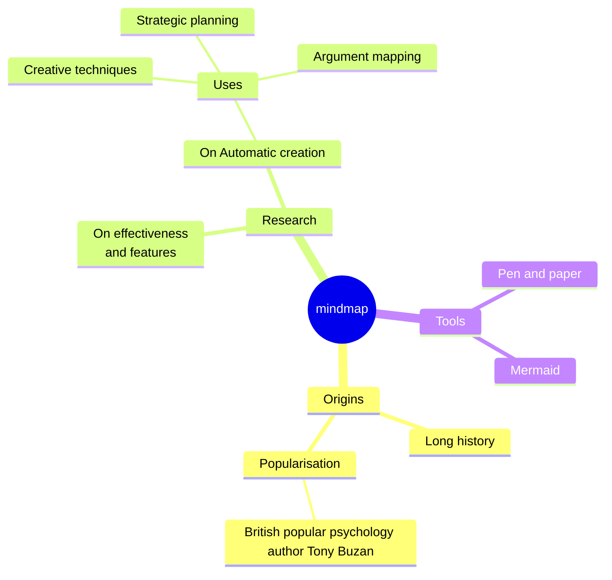

### Sankey
```mermaid
sankey-beta

%% source, target, value
Electricity grid, Over generation \/ exports, 104.453
Electricity grid, Heating and cooling - homes, 113.726
Electricity grid, H2 conversion, 27.14
```

### Block Diagram
```mermaid
packet-beta
0-15: "Source Port"
16-31: "Destination Port"
32-63: "Sequence Number"
64-95: "Acknowledgment Number"
96-99: "Data Offset"
100-105: "Reserved"
106: "URG"
107: "ACK"
108: "PSH"
109: "RST"
110: "SYN"
111: "FIN"
112-127: "Window"
128-143: "Checksum"
144-159: "Urgent Pointer"
160-191: "(Options and Padding)"
192-255: "Data (variable length)"
```

### Kanban
```mermaid
---
config:
  kanban:
    ticketBaseUrl: 'https:\/\/mermaidchart.atlassian.net\/browse\/#TICKET#'
---
kanban
  Todo
    ["Create Documentation"]
    docs["Create Blog about the new diagram"]
  ["In progress"]
    id6["Create renderer so that it works in all cases. We also add som extra text here for testing purposes. And some more just for the extra flare."]
  id9["Ready for deploy"]
    id8["Design grammar"]@{ assigned: 'knsv' }
  id10["Ready for test"]
    id4["Create parsing tests"]@{ ticket: MC-2038, assigned: 'K.Sveidqvist', priority: 'High' }
    id66["last item"]@{ priority: 'Very Low', assigned: 'knsv' }
  id11["Done"]
    id5["define getData"]
    id2["Title of diagram is more than 100 chars when user duplicates diagram with 100 char"]@{ ticket: MC-2036, priority: 'Very High'}
    id3["Update DB function"]@{ ticket: MC-2037, assigned: knsv, priority: 'High' }

  id12["Can't reproduce"]
    id3["Weird flickering in Firefox"]
```

### Architecture Diagram
```mermaid
architecture-beta
    group api(cloud)["API"]

    service db(database)["Database"] in api
    service disk1(disk)["Storage"] in api
    service disk2(disk)["Storage"] in api
    service server(server)["Server"] in api

    db:L -- R:server
    disk1:T -- B:server
    disk2:T -- B:db
```

### Sequence Diagram
```mermaid
sequenceDiagram
Alice ->> Bob: Hello Bob, how are you?
Bob-->>John: How about you John?
Bob--x Alice: I am good thanks!
Bob-x John: I am good thanks!
Note right of John: Bob thinks a long<br/>long time, so long<br/>that the text does<br/>not fit on a row.

Bob-->Alice: Checking with John...
Alice->John: Yes... John, how are you?
```

### Three-way Handshake (Sequence Diagram)
```mermaid
sequenceDiagram
  participant c as Client
  participant s as Server
  
  c->>s: SYN
  note over c, s: SEQ1 = 100<br>ACK1 not set
  s->>c: SYN+ACK
  note over c, s: SEQ2 = 300<br>ACK2 = 100+1 = 101
  c->>s: ACK
  note over c, s: SEQ3 = 101<br>ACK3 = 300+1 = 301
```

### Sequence with Loop & Notes
```mermaid
sequenceDiagram
    autonumber
    Student->>Admin: Can I enrol this semester?
    loop enrolmentCheck
        Admin->>Admin: Check previous results
    end
    Note right of Admin: Exam results may <br> be delayed
    Admin-->>Student: Enrolment success
    Admin->>Professor: Assign student to tutor
    Professor-->>Admin: Student is assigned
```

### Class Diagram
```mermaid
classDiagram
    Animal <|-- Duck
    Animal <|-- Fish
    Animal <|-- Zebra
    Animal : +int age
    Animal : +String gender
    Animal: +isMammal()
    Animal: +mate()
    class Duck{
      +String beakColor
      +swim()
      +quack()
    }
    class Fish{
      -int sizeInFeet
      -canEat()
    }
    class Zebra{
      +bool is_wild
      +run()
    }
```

### State Diagram

#### Example State Diagram
```mermaid
stateDiagram-v2
    [*] --> Still
    Still --> [*]
    Still --> Moving
    Moving --> Still
    Moving --> Crash
    Crash --> [*]
```

#### Example Complex State Diagram
```mermaid
stateDiagram-v2
  [*] --> Unwritten
  
  Unwritten --> Open: Open
  Unwritten --> Void: Void
  
  Open --> Void: Void
  Open --> Cancelled: Cancel
  Open --> Closed: Close
  Open --> Open: Update
  
  Closed --> Open: Open
```

```mermaid
stateDiagram-v2
    [*] --> First
    state First {
        [*] --> second
        second --> [*]
    }
```

```mermaid
 stateDiagram-v2
    state fork_state <<fork>>
      [*] --> fork_state
      fork_state --> State2
      fork_state --> State3

      state join_state <<join>>
      State2 --> join_state
      State3 --> join_state
      join_state --> State4
      State4 --> [*]
```

```mermaid
stateDiagram-v2
        State1: The state with a note
        note right of State1
            Important information! You can write
            notes.
        end note
        State1 --> State2
        note left of State2 : This is the note to the left.
```

#### Shipment Status

```mermaid
stateDiagram-v2 
  direction LR
  [*] --> Initialed
  Initialed --> SellerSent
  SellerSent --> Transported
  Transported --> BuyerPicked
  BuyerPicked --> Delivered
  Delivered --> [*]
  
  BuyerPicked --> BuyerSent
  BuyerSent --> ReturnTransported
  ReturnTransported --> SellerPicked
  SellerPicked --> [*]
  
  Transported --> ReturnTransported: buyer doesn't pick up the item after 1 week
```

### Gantt Diagram

#### Example Gantt diagram
```mermaid
gantt
 title Example Gantt diagram
    dateFormat  YYYY-MM-DD
    section Team 1
    Research & requirements :done, a1, 2020-03-08, 2020-04-10
    Review & documentation : after a1, 20d
    section Team 2
    Implementation      :crit, active, 2020-03-25  , 20d
    Testing      :crit, 20d
```

#### Another Example Gantt Diagram
```mermaid
gantt
dateFormat  YYYY-MM-DD
title Adding GANTT diagram to mermaid
excludes weekdays 2014-01-10

section A section
Completed task            :done,    des1, 2014-01-06,2014-01-08
Active task               :active,  des2, 2014-01-09, 3d
Future task               :         des3, after des2, 5d
Future task2               :         des4, after des3, 5d
```

### Entity Relationship Riagram

#### Example Entity Relationship Riagram
```mermaid
erDiagram
    CUSTOMER ||--o{ ORDER : places
    CUSTOMER {
        string name
        string custNumber
        string sector
    }
    ORDER ||--|{ LINE-ITEM : contains
    ORDER {
        int orderNumber
        string deliveryAddress
    }
    LINE-ITEM {
        string productCode
        int quantity
        float pricePerUnit
    }
```

#### Another Example Entity Relationship Riagram

```mermaid
erDiagram
          CUSTOMER }|..|{ DELIVERY-ADDRESS : has
          CUSTOMER ||--o{ ORDER : places
          CUSTOMER ||--o{ INVOICE : \"liable for\"
          DELIVERY-ADDRESS ||--o{ ORDER : receives
          INVOICE ||--|{ ORDER : covers
          ORDER ||--|{ ORDER-ITEM : includes
          PRODUCT-CATEGORY ||--|{ PRODUCT : contains
          PRODUCT ||--o{ ORDER-ITEM : \"ordered in\"
```

### User Journey Diagram

```mermaid
  journey
    title My working day
    section Go to work
      Make tea: 5: Me
      Go upstairs: 3: Me
      Do work: 1: Me, Cat
    section Go home
      Go downstairs: 5: Me
      Sit down: 3: Me
```

### Pie Chart Diagram

```mermaid
pie title Pets adopted by volunteers
    "Dogs" : 386
    "Cats" : 85
    "Rats" : 15
```

### Requirement diagram

```mermaid
requirementDiagram

    requirement test_req {
    id: 1
    text: the test text.
    risk: high
    verifymethod: test
    }

    element test_entity {
    type: simulation
    }

    test_entity - satisfies -> test_req
```
